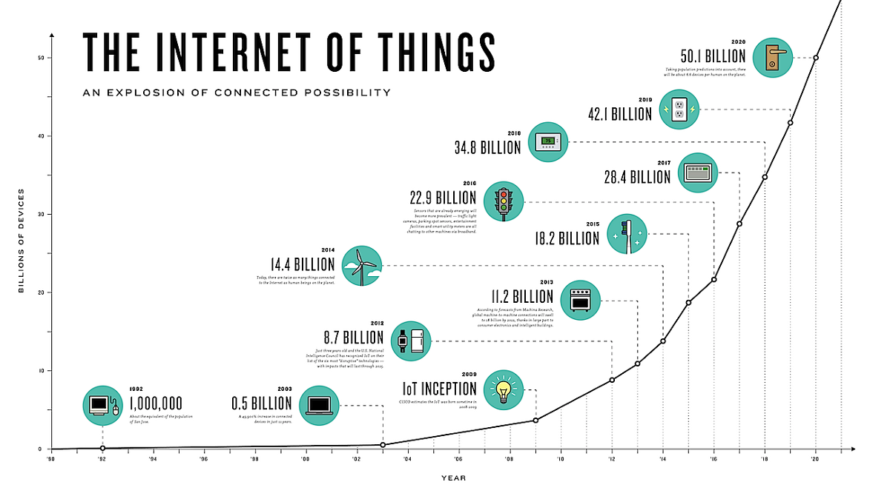
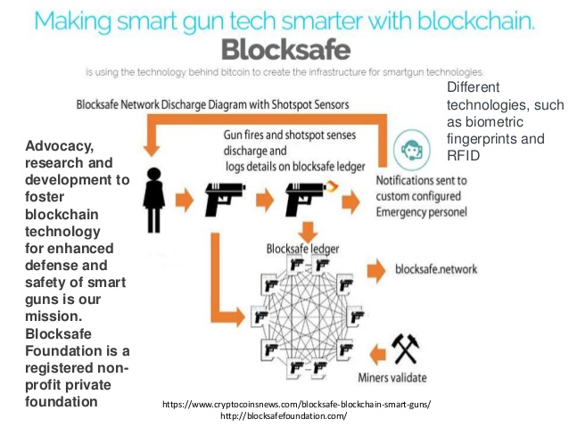
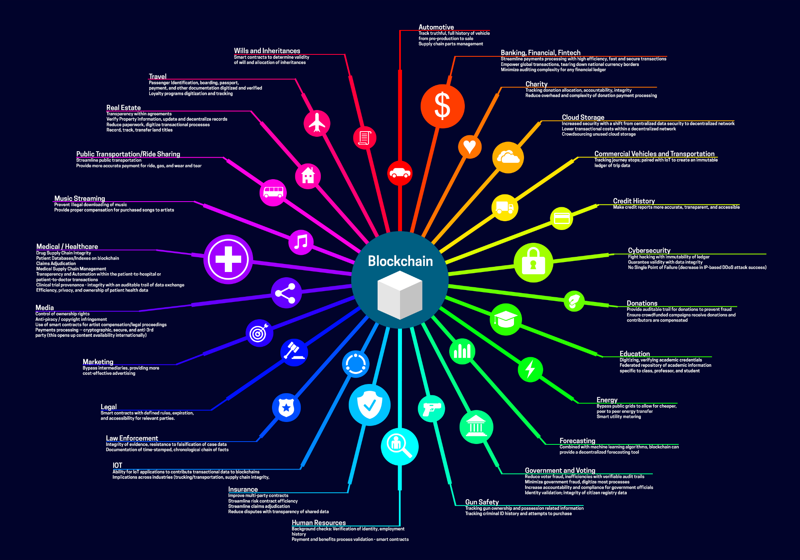
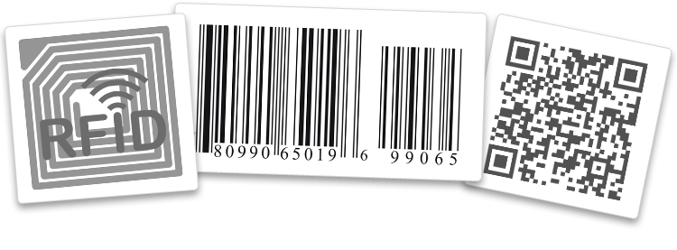
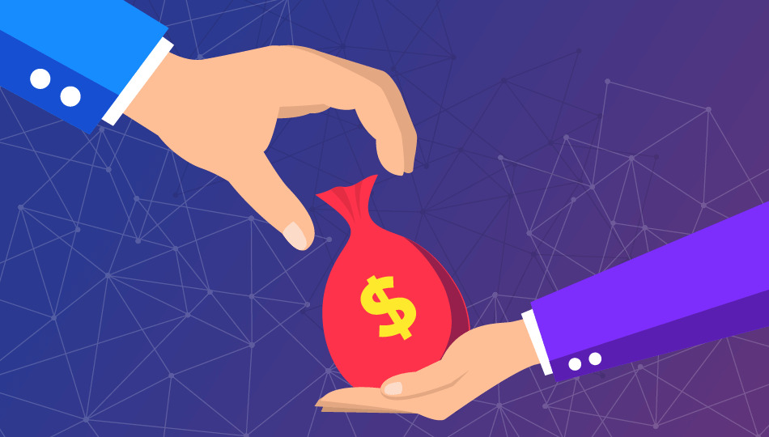
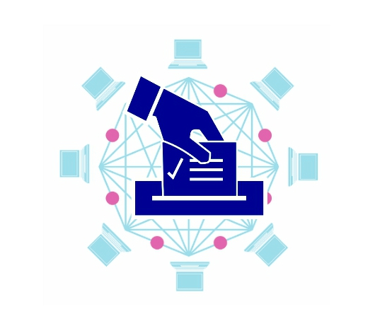
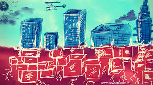
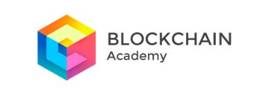
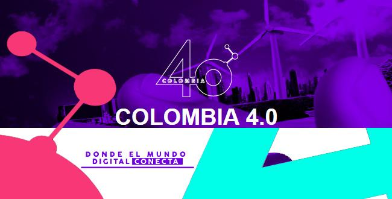

<section id="themes">
    <h2>Themes</h2>
        

            Set your presentation theme:  
            <!-- Hacks to swap themes after the page has loaded. Not flexible and only intended for the reveal.js demo deck. -->
                        <a href="#" onclick="document.getElementById('theme').setAttribute('href','css/theme/black.css'); return false;">Black (default)</a> -
            <a href="#" onclick="document.getElementById('theme').setAttribute('href','css/theme/white.css'); return false;">White</a> -
            <a href="#" onclick="document.getElementById('theme').setAttribute('href','css/theme/league.css'); return false;">League</a> -
            <a href="#" onclick="document.getElementById('theme').setAttribute('href','css/theme/sky.css'); return false;">Sky</a> -
            <a href="#" onclick="document.getElementById('theme').setAttribute('href','css/theme/beige.css'); return false;">Beige</a> -
            <a href="#" onclick="document.getElementById('theme').setAttribute('href','css/theme/simple.css'); return false;">Simple</a>  
            <a href="#" onclick="document.getElementById('theme').setAttribute('href','css/theme/serif.css'); return false;">Serif</a> -
            <a href="#" onclick="document.getElementById('theme').setAttribute('href','css/theme/blood.css'); return false;">Blood</a> -
            <a href="#" onclick="document.getElementById('theme').setAttribute('href','css/theme/night.css'); return false;">Night</a> -
            <a href="#" onclick="document.getElementById('theme').setAttribute('href','css/theme/moon.css'); return false;">Moon</a> -
            <a href="#" onclick="document.getElementById('theme').setAttribute('href','css/theme/solarized.css'); return false;">Solarized</a>
        

</section>

H:

BLOCKCHAIN TECHNOLOGY

<a href="http://exsis.co/" target="_blank">

Exsis Software & Solutions

H:

## Index

 1. Understanding Blockchain<!-- .element: class="fragment" data-fragment-index="1"-->
    * The General Ledger
    * The Meaning of Decentralization
    * So, what is Blockchain?
    * Where is the blockchain's power?
    * Blockchain future
    * Examples
    * Applications

V:
## Index (part 2)

 2. Hyperledger <!-- .element: class="fragment" data-fragment-index="2"-->
    * What is Hyperledger?
    * Hyperledger Fabric
 3. Smart Contracts<!-- .element: class="fragment" data-fragment-index="3"-->

V:
## Index (part 3)
4. Fighting Corruption with Blockchain
5. Being Part of the Revolution
6. Issues with Blockchain

H:

# 1. Understanding Blockchain

V:
### The General Ledger

A general ledger is a company's set of numbered accounts for its accounting records. The ledger provides a complete record of financial transactions over the life of the company.

V:
### The Meaning of Decentralization

“distributed means not all the processing of the transactions is done in the same place”, whereas “decentralized means that not one single entity has control over all the processing”

V:
### The Meaning of Decentralization

V:
### So, what is Blockchain?

Let's start by saying that it is a distributed general ledger of digital transformation

V:

### So, what is BLockchain?

Now a formal definition:

“The blockchain is an incorruptible digital ledger of transactions that can be programmed to record not just financial transactions but virtually <a href="https://blockgeeks.com/guides/what-is-blockchain-technology/" target="_blank">everything of value</a>”

V:

### Where is the blockchain's power?

A matter of trust: As a distributed, decentralized ledger, blockchain contains data integrity and authenticity characteristics that can guarantee trust among untrusted parties as they conduct digital transactions. And that opens up a world of possibilities.

V:

### Blockchain Future

V:

# Applications

V:
## Cryptocurrencies

<a href="https://blockgeeks.com/guides/what-is-cryptocurrency/" target="_blank">

V:
## Healthcare

Patient’s medical history is a puzzle with its pieces dispersed across multiple providers and organizations. Blockchain could help us assemble all of these pieces in real-time and view the entire picture of a patient’s health. Check this <a href="https://www.forbes.com/sites/forbestechcouncil/2018/04/13/blockchain-in-health-care-the-good-the-bad-and-the-ugly/#17e8dbc96278" target="_blank">Forbes article</a>
V:
## Internet of things

<a href="https://medium.com/iotex/blockchains-for-the-iot-c4d828b5a9ed" target="_blank">

V:
## Energy provision and management
<a href="https://www.cbinsights.com/research/blockchain-energy-applications/" target="_blank">

V:
## Gun Tracking

<a href="https://www.blocksafe.network/" target="_blank">

V:
## Background Checks And Employment Verification (CV)

<a href="https://appii.io/build-verified-cv-blockchain/" target="_blank">

V:
## TRANSPORT

<a href="https://coinjoker.com/blockchain-technology-public-transportation/" target="_blank">

V:
## Many others

<a href="https://cryptobriefing.com/an-a-z-of-blockchain-use-cases/" target="_blank">

V:
### A TED TALK ABOUT IT

<iframe width="800" height="600" src="https://www.youtube.com/embed/RplnSVTzvnU" frameborder="0" allowfullscreen></iframe>

V:
### Must-Read Links

* <a href="https://medium.com/@VitalikButerin/the-meaning-of-decentralization-a0c92b76a274" target="_blank">Decentralization</a>
* <a href="https://www.comparitech.com/blog/information-security/what-is-blockchain-experts-explain/" target="_blank">Blockchain in less than 150 words (by experts)</a>
* <a href="https://www.linkedin.com/pulse/whats-next-generation-internet-surprise-its-all-don-tapscott" target="_blank">The Next Generation Internet?: World Wide Ledger</a>
* <a href="https://www.juniper.net/us/en/insights/blockchain/" target="_blank">Blockchain beyond cryptocurrency and financial services</a>
* <a href="https://blockgeeks.com/guides/blockchain-applications/
" target="_blank">17 Blockchain Applications That Are Transforming Society</a>
* <a href="https://www.raconteur.net/business/the-future-of-blockchain-in-8-charts" target="_blank">Future of Blockchain in 8 charts</a>

H: # 2. Hyperledger
V:
### Whats is Hyperledger?

Is an open source collaborative effort created to advance cross-industry blockchain technologies. It is a global collaboration, hosted by The Linux Foundation, including leaders in finance, banking, Internet of Things, supply chains, manufacturing and Technology.
V:

### Hyperledger Fabric

Hyperledger Fabric is a blockchain framework implementation and one of the Hyperledger projects hosted by The Linux Foundation. It uses the Go programming language 1.7.x for many of its components.

V:

### Hyperledger Composer

Hyperledger Composer is an application development framework which simplifies and expedites the creation of Hyperledger fabric blockchain applications.  

V:
### IBM BLockchain - Hyperledger

 IBM provides blockchain solutions and services leveraging Hyperledger technologies, including Hyperledger Fabric and Hyperledger Composer.
V:
### Blockchain for business

<iframe width="800" height="600" src="https://www.youtube.com/embed/EKa5Gh9whgU" frameborder="0" allowfullscreen></iframe>

V:
### Must-Read Links

* <a href="https://www.bbva.com/es/bbva-se-une-hyperledger-la-principal-comunidad-open-source-blockchain/" target="_blank">BBVA joins Hyperledger</a>
* <a href="https://cointelegraph.com/news/oracle-officially-joins-hyperledger-blockchain-project" target="_blank">Oracle Officially Joins Hyperledger Blockchain Project
</a>
* <a href="https://criptonoticias.com/adopcion/visa-ibm-usaa-microsoft-buscan-desarrolladores-blockchain-nuevos-proyectos/#axzz4s3jh6SQd" target="_blank">Visa, IBM, USAA and Microsoft seek blockchain developers for new projects
</a>

H:

# 3. Smart Contracts

V:
### What is a Smart Contract?

Is a computer program that directly controls the transfer of digital currencies or assets between parties under certain conditions.

V:
### How a Smart Contract works?

V:
### putting it all together
<iframe width="800" height="600" src="https://www.youtube.com/embed/FkeLDPZ-v8g" frameborder="0" allowfullscreen></iframe>

V:
### Must-Read Links
* <a href="https://blockgeeks.com/guides/smart-contracts/" target="_blank">A Beginner’s Guide to Smart Contracts</a>
* <a href="https://www.coindesk.com/information/ethereum-smart-contracts-work/" target="_blank">How Do Ethereum Smart Contracts Work?</a>
* <a href="https://www.adjoint.io/posts/financial-industry-revolution.html" target="_blank">Smart Contracts - A revolution in the Financial industry</a>

H:
# 4. FIGHTING CORRUPTION WITH BLOCKCHAIN
V:
### Supply Chain

Is difficult for consumers to know whether some parts of the products were produced
by illegal child labour, or within a country where conflicting mineral issues occur. Such a lack of transparency in the supply chain or logistics becomes more critical when it comes topharmaceutical or medical industries in which illegale or fraud medications can lead to fatal consequences.

V:
### Supply Chain

Blockchain technology on supply chain has the potential to increase supply chain transparency for both suppliers and consumer, and improve contractual coordination. The blockchain technology becomes more useful when it combines with the recent IoT technologies such as RFID sensors or QR codes.

<a href="https://nektardata.com/a-brief-guide-to-understand-the-difference-between-qr-and-rfid-tags/" target="_blank">

V:
### Public sectors / Government

Government and financial institutions can use the technology as a means of combating financial crime such as money laundering and tracking any fund transferred for criminal activities such as drugs trade or terrorism.

V:
### Voting System

Elections results may not always reflect the public opinion and it is subject to
manipulation by a corrupted authority. In such circumstances, the blockchain technology ensures that
every eligible vote is counted accurately without any manipulation and this can be a huge step
towards democracy. BLockchain can transform the traditional paper-based voting
system to a digitalized one.e

V:
### Property & real-estate management

In order to root out the corruptions occurring on land registries, the government of Honduras partnered with a blockchain start-up to develop a system that kept the land record on a transparent and unhackable blockchain platform. This may keep the government officials supervised from abusing their power while encouraging land owners to officially register their lands.

V:
### International Trade

Paper-based documents between trading parties and banks are subject to manipulation, loss and fraud. Blockchain trading parties can manage the ownership of documents and eliminate
disputes, forgeries and double-spending risks. Smart contract can log the change of
ownership and automatically transfer payments for
efficient and transparent way we trade.

H:
# 5. BEING PART OF THE REVOLUTION
V:

### COMMUNITIES

* Activities to strengthen the community and the actors articulation of the Blockchain and crypto ecosystem in Colombia.
* Basic training of the Blockchain technology.
* Be an interlocutor with the national government, offering information and analysis that allows you to make informed decisions for the use of Blockchain technology and cryptocurrencies in Colombia

<a href="https://fundacionblockchaincolombia.org/" target="_blank">

V:
<a href="https://blockchainacademy.com.co/" target="_blank">

V:
### Events

<a href="http://col40.co/638/w3-channel.html" target="_blank">

V:
### Events

<a href="https://www.meetup.com/topics/blockchain/" target="_blank">

V:
### Forums
<a href="https://bitcointalk.org/" target="_blank">
