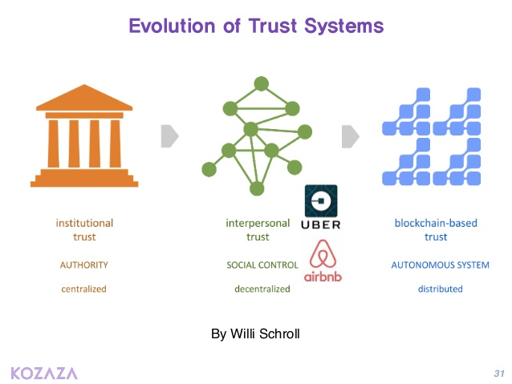
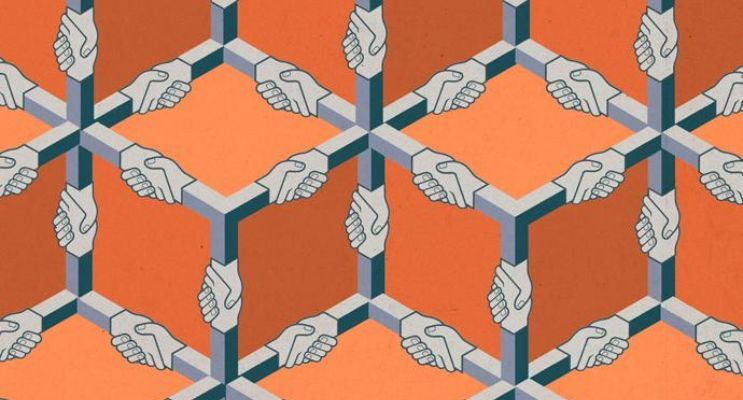
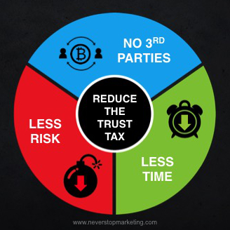
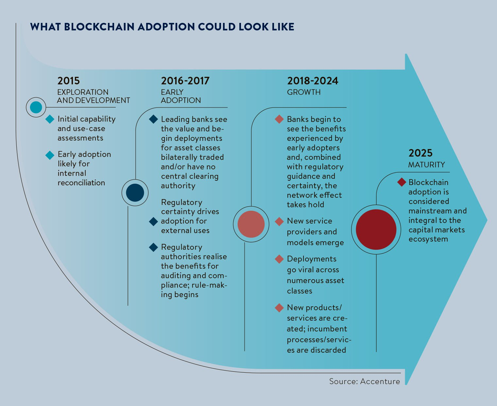
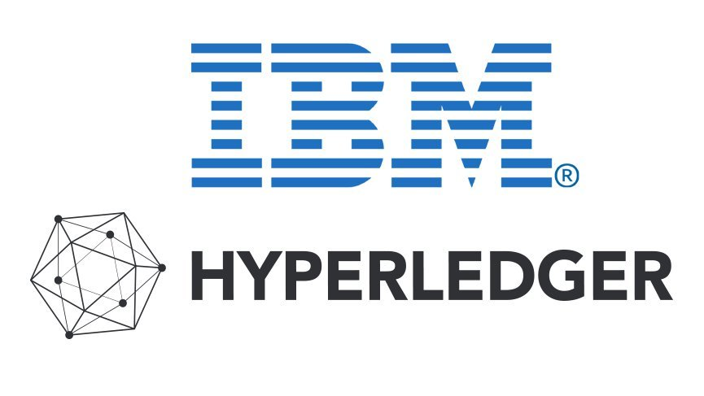
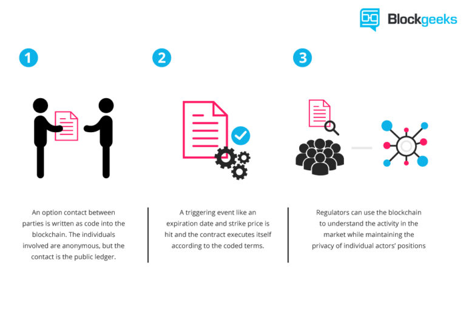

<section id="themes">
    <h2>Themes</h2>
        

            Set your presentation theme:  
            <!-- Hacks to swap themes after the page has loaded. Not flexible and only intended for the reveal.js demo deck. -->
                        <a href="#" onclick="document.getElementById('theme').setAttribute('href','css/theme/black.css'); return false;">Black (default)</a> -
            <a href="#" onclick="document.getElementById('theme').setAttribute('href','css/theme/white.css'); return false;">White</a> -
            <a href="#" onclick="document.getElementById('theme').setAttribute('href','css/theme/league.css'); return false;">League</a> -
            <a href="#" onclick="document.getElementById('theme').setAttribute('href','css/theme/sky.css'); return false;">Sky</a> -
            <a href="#" onclick="document.getElementById('theme').setAttribute('href','css/theme/beige.css'); return false;">Beige</a> -
            <a href="#" onclick="document.getElementById('theme').setAttribute('href','css/theme/simple.css'); return false;">Simple</a>  
            <a href="#" onclick="document.getElementById('theme').setAttribute('href','css/theme/serif.css'); return false;">Serif</a> -
            <a href="#" onclick="document.getElementById('theme').setAttribute('href','css/theme/blood.css'); return false;">Blood</a> -
            <a href="#" onclick="document.getElementById('theme').setAttribute('href','css/theme/night.css'); return false;">Night</a> -
            <a href="#" onclick="document.getElementById('theme').setAttribute('href','css/theme/moon.css'); return false;">Moon</a> -
            <a href="#" onclick="document.getElementById('theme').setAttribute('href','css/theme/solarized.css'); return false;">Solarized</a>
        

</section>

H:

MARBLES IBM: AN INTRODUCTION TO BLOCKCHAIN

Juan Manuel Cuestas

H:

## Index

 1. Understanding Blockchain<!-- .element: class="fragment" data-fragment-index="1"-->
    * The General Ledger
    * The Meaning of Decentralization
    * So, what is Blockchain?
    * Where is the blockchain's power?
    * Blockchain future
    * Examples
    * Applications

V:
## Index (part 2)

 2. Hyperledger <!-- .element: class="fragment" data-fragment-index="2"-->
    * What is Hyperledger?
    * Hyperledger Fabric
 3. Smart Contracts<!-- .element: class="fragment" data-fragment-index="3"-->

 V:
## Index (part 3)
 4. Marbles <!-- .element: class="fragment" data-fragment-index="4"-->
    * What is Marbles?
    * A marble
    * Some Concepts
    * gRPC
    * How it works?
    * Some code

H:

# 1. Understanding Blockchain

V:
### The General Ledger

A general ledger is a company's set of numbered accounts for its accounting records. The ledger provides a complete record of financial transactions over the life of the company.

V: 
### The Meaning of Decentralization

“distributed means not all the processing of the transactions is done in the same place”, whereas “decentralized means that not one single entity has control over all the processing”

V: 
### The Meaning of Decentralization

V:
### So, what is Blockchain?

Let's start by saying that it is a distributed general ledger of digital transformation

V:

### So, what is BLockchain?

Now a formal definition:

“The blockchain is an incorruptible digital ledger of economic transactions that can be programmed to record not just financial transactions but virtually <a href="https://blockgeeks.com/guides/what-is-blockchain-technology/" target="_blank">everything of value</a>”[1] 
V:

### Where is the blockchain's power?

A matter of trust: As a distributed, decentralized ledger, blockchain contains data integrity and authenticity characteristics that can guarantee trust among untrusted parties as they conduct digital transactions. And that opens up a world of possibilities.

V: 

### Blockchain Future

V:

### Applications

* Healthcare.
* Internet of things (IoT).
* Energy provision and mManagement.
* Gun Tracking.
* Background Checks And Employment Verification
* Many others...

V:

### Must-Read Links

* <a href="https://medium.com/@VitalikButerin/the-meaning-of-decentralization-a0c92b76a274" target="_blank">Decentralization</a>
* <a href="https://www.comparitech.com/blog/information-security/what-is-blockchain-experts-explain/" target="_blank">Blockchain in less than 150 words (by experts)</a>
* <a href="https://www.linkedin.com/pulse/whats-next-generation-internet-surprise-its-all-don-tapscott" target="_blank">The Next Generation Internet?: World Wide Ledger</a>
* <a href="https://www.juniper.net/us/en/insights/blockchain/" target="_blank">Blockchain beyond cryptocurrency and financial services</a>
* <a href="https://blockgeeks.com/guides/blockchain-applications/
" target="_blank">17 Blockchain Applications That Are Transforming Society</a>
* <a href="https://www.raconteur.net/business/the-future-of-blockchain-in-8-charts" target="_blank">Future of Blockchain in 8 charts</a>

H: # 2. Hyperledger 
V:
### Whats is Hyperledger?

Is an open source collaborative effort created to advance cross-industry blockchain technologies. It is a global collaboration, hosted by The Linux Foundation, including leaders in finance, banking, Internet of Things, supply chains, manufacturing and Technology.
V: 

### Hyperledger Fabric

Hyperledger Fabric is a blockchain framework implementation and one of the Hyperledger projects hosted by The Linux Foundation. It uses the Go programming language 1.7.x for many of its components.

V: 

### Hyperledger Composer

Hyperledger Composer is an application development framework which simplifies and expedites the creation of Hyperledger fabric blockchain applications.  

V: 
### IBM BLockchain - Hyperledger

 IBM provides blockchain solutions and services leveraging Hyperledger technologies, including Hyperledger Fabric and Hyperledger Composer.

H:

# 3. Smart Contracts

V: 
### What is a Smart COntract?

Is a computer program that directly controls the transfer of digital currencies or assets between parties under certain conditions. 

V:
### How a Smart Contract works?

H: 

# 4. MARBLES

V:

 ### What is Marbles?

Is an IBM Blockchain demo aid a developer learn the basics of chaincode and app development with a Fabric network.

V:
### A marble

 It's the Marbles coin, and it has the next properties: 

* id (unique string, will be used as key)
* color (string, css color names)
* size (int, size in mm)
* owner (string)

V:
### Marbles Transactions:

V:

### Some Concepts

* Peer: A peer is a member of the blockchain and is running Hyperledger Fabric. From marble's context, the peers are owned and operated by my marble company.

* CA (Certificate Authority): The CA will provide transaction certificates for clients such as the marbles node.js application.

V:
### Some Concepts
* Orderer: An orderer or ordering service is a member of the blockchain network whose main responsibility is to package transactions into blocks.

* Users: A user is an entity that is authorized to interact with the blockchain. In the Marbles context, this is our admin. The user can query and write to the ledger.

V:
### Some Concepts
Blocks: Blocks contain transactions and a hash to verify integrity.

Transactions or Proposals: These represent interactions to the blockchain ledger. A read or write request of the ledger is sent as a transaction/proposal.

V:
### Some Concepts
Ledger: This is the storage for the blockchain on a peer. It contains the actual block data which consist of transaction parameters and key value pairs. It is written by chaincode.

Chaincode: Chaincode is Hyperledger Fabric speak for smart contracts. It defines the assets and all rules about assets.

V:
### gRPC
 Is an open source remote procedure call (RPC) system initially developed at Google. 

V:
### How it works?

V:

### Some code
Let’s look at how transferring a marble is done by starting at the chaincode: 
/chaincode/marbles.go

<section>
  <pre><code data-trim>
type Marble struct {
        ObjectType string        `json:"docType"`
        Id       string          `json:"id"`
        Color      string        `json:"color"`
        Size       int           `json:"size"`
        Owner      OwnerRelation `json:"owner"`
    }
  </code></pre>
</section>

V:
### Some code
This set_owner() function will change the owner of a particular marble:

/chaincode/write_ledger.go
<section>
  <pre><code data-trim>
func set_owner(stub shim.ChaincodeStubInterface, args []string) pb.Response {
        var err error
        fmt.Println("starting set_owner")

        // this is quirky
        // todo - get the "company that authed the transfer" from the certificate instead of an argument
        // should be possible since we can now add attributes to the enrollment cert
        // as is.. this is a bit broken (security wise), but it's much much easier to demo! holding off for demos sake

        if len(args) != 3 {
            return shim.Error("Incorrect number of arguments. Expecting 3")
        }

        // input sanitation
        err = sanitize_arguments(args)
        if err != nil {
            return shim.Error(err.Error())
        }

        var marble_id = args[0]
        var new_owner_id = args[1]
        var authed_by_company = args[2]
        fmt.Println(marble_id + "->" + new_owner_id + " - |" + authed_by_company)

        // check if user already exists
        owner, err := get_owner(stub, new_owner_id)
        if err != nil {
            return shim.Error("This owner does not exist - " + new_owner_id)
        }

        // get marble's current state
        marbleAsBytes, err := stub.GetState(marble_id)
        if err != nil {
            return shim.Error("Failed to get marble")
        }
        res := Marble{}
        json.Unmarshal(marbleAsBytes, &res)           //un stringify it aka JSON.parse()

        // check authorizing company
        if res.Owner.Company != authed_by_company{
            return shim.Error("The company '" + authed_by_company + "' cannot authorize transfers for '" + res.Owner.Company + "'.")
        }

        // transfer the marble
        res.Owner.Id = new_owner_id                   //change the owner
        res.Owner.Username = owner.Username
        res.Owner.Company = owner.Company
        jsonAsBytes, _ := json.Marshal(res)           //convert to array of bytes
        err = stub.PutState(args[0], jsonAsBytes)     //rewrite the marble with id as key
        if err != nil {
            return shim.Error(err.Error())
        }

        fmt.Println("- end set owner")
        return shim.Success(nil)
    }
  </code></pre>
</section>
