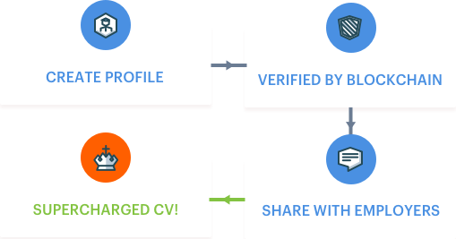
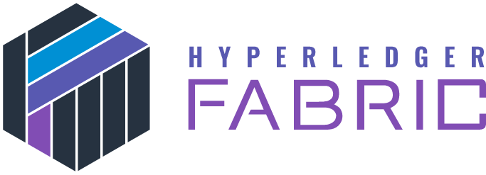
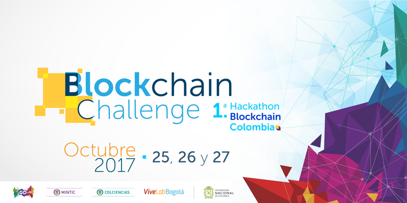
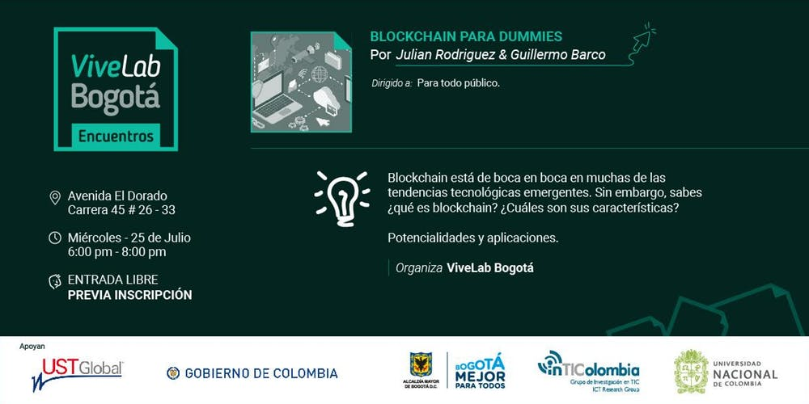

<section id="themes">
    <h2>Themes</h2>
        

            Set your presentation theme:  
            <!-- Hacks to swap themes after the page has loaded. Not flexible and only intended for the reveal.js demo deck. -->
                        <a href="#" onclick="document.getElementById('theme').setAttribute('href','css/theme/black.css'); return false;">Black (default)</a> -
            <a href="#" onclick="document.getElementById('theme').setAttribute('href','css/theme/white.css'); return false;">White</a> -
            <a href="#" onclick="document.getElementById('theme').setAttribute('href','css/theme/league.css'); return false;">League</a> -
            <a href="#" onclick="document.getElementById('theme').setAttribute('href','css/theme/sky.css'); return false;">Sky</a> -
            <a href="#" onclick="document.getElementById('theme').setAttribute('href','css/theme/beige.css'); return false;">Beige</a> -
            <a href="#" onclick="document.getElementById('theme').setAttribute('href','css/theme/simple.css'); return false;">Simple</a>  
            <a href="#" onclick="document.getElementById('theme').setAttribute('href','css/theme/serif.css'); return false;">Serif</a> -
            <a href="#" onclick="document.getElementById('theme').setAttribute('href','css/theme/blood.css'); return false;">Blood</a> -
            <a href="#" onclick="document.getElementById('theme').setAttribute('href','css/theme/night.css'); return false;">Night</a> -
            <a href="#" onclick="document.getElementById('theme').setAttribute('href','css/theme/moon.css'); return false;">Moon</a> -
            <a href="#" onclick="document.getElementById('theme').setAttribute('href','css/theme/solarized.css'); return false;">Solarized</a>
        

</section>

H:

TECNOLOGÍA BLOCKCHAIN

<a href="http://exsis.co/" target="_blank">

Exsis Software & Soluciones

H:

## Contenido

 1. Entendiendo Blockchain<!-- .element: class="fragment" data-fragment-index="1"-->
    * El Libro Mayor
    * El significado de la Descentralización
    * ¿Qué es Blockchain?
    * ¿Dónde está el potencial de Blockchain?
    * Blockchain a futuro
    * Ejemplos
    * Aplicaciones

V:
## Contenido (parte 2)

 2. Hyperledger <!-- .element: class="fragment" data-fragment-index="2"-->
    * Qué es Hyperledger?
    * Hyperledger Fabric
 3. Contratos Inteligentes<!-- .element: class="fragment" data-fragment-index="3"-->

V:
## Contenido (parte 3)
4. Combatiendo la corrupción con Blockchain
5. ¿Cómo ser parte de la revolución?

H:

# 1. Entendiendo Blockchain

V:
### El Libro Mayor

El libro mayor proporciona un registro completo de las transacciones financieras a lo largo de la vida de una empresa, lleva el conjunto de cuentas numeradas de una empresa para sus registros contables.

V:
### The Meaning of Decentralization

“distributed means not all the processing of the transactions is done in the same place”, whereas “decentralized means that not one single entity has control over all the processing”

V:
### El significado de la Descentralización

V:
### ¿Qué es Blockchain?

Empecemos por decir que es el libro mayor y distribuido de la transformación digital.

V:

### ¿Qué es Blockchain?

Ahora una definición formal:
"Blockchain es un libro mayor digital e incorruptib<le de transacciones que pueden ser programadas para registrar no sólo transacciones financieras sino los movimientos de <a href="https://blockgeeks.com/guides/what-is-blockchain-technology/" target="_blank">todo lo que consideremos de valor</a>"

V:

### ¿Dónde está el potencial de Blockchain?

Una cuestión de confianza:

Blockchain asegura la integridad de los datos junto con características de autenticidad mediante mecanismos de criptografía avanzada que pueden garantizar la confianza entre los miembros de la blockchain mientras realizan transacciones digitales, lo que abre un mundo de posibilidades.

V:

### El Futuro de Blockchain

V:

# Aplicaciones

V:
## Criptomonedas

<a href="https://blockgeeks.com/guides/what-is-cryptocurrency/" target="_blank">

V:
## Salud
<a href="https://www.forbes.com/sites/forbestechcouncil/2018/04/13/blockchain-in-health-care-the-good-the-bad-and-the-ugly/#17e8dbc96278" target="_blank">

El historial médico de un paciente en la actualidad es un rompecabezas que se distribuye entre múltiples proovedores, organizaciones y profesionales de la salud. Blockchain puede ayudar a poner estas piezas juntas para tener un panorama completo de la salud de un paciente

V:
## Internet de las Cosas

<a href="https://medium.com/iotex/blockchains-for-the-iot-c4d828b5a9ed" target="_blank">

V:
## Provisión y gestión de energía
<a href="https://www.cbinsights.com/research/blockchain-energy-applications/" target="_blank">

V:
## Rastreo de Armas

<a href="https://www.blocksafe.network/" target="_blank">

V:
## Contratación (CV)

<a href="https://appii.io/build-verified-cv-blockchain/" target="_blank">

V:
## TRANSPORTE

<a href="https://coinjoker.com/blockchain-technology-public-transportation/" target="_blank">

V:
## Muchas Otras

<a href="https://cryptobriefing.com/an-a-z-of-blockchain-use-cases/" target="_blank">

V:
### Una Charla al respecto...

<iframe width="800" height="600" src="https://www.youtube.com/embed/RplnSVTzvnU" frameborder="0" allowfullscreen></iframe>

V:
### Enlaces de interés

* <a href="https://medium.com/@VitalikButerin/the-meaning-of-decentralization-a0c92b76a274" target="_blank">Decentralization</a>
* <a href="https://www.comparitech.com/blog/information-security/what-is-blockchain-experts-explain/" target="_blank">Blockchain in less than 150 words (by experts)</a>
* <a href="https://www.linkedin.com/pulse/whats-next-generation-internet-surprise-its-all-don-tapscott" target="_blank">The Next Generation Internet?: World Wide Ledger</a>
* <a href="https://www.juniper.net/us/en/insights/blockchain/" target="_blank">Blockchain beyond cryptocurrency and financial services</a>
* <a href="https://blockgeeks.com/guides/blockchain-applications/
" target="_blank">17 Blockchain Applications That Are Transforming Society</a>
* <a href="https://www.raconteur.net/business/the-future-of-blockchain-in-8-charts" target="_blank">Future of Blockchain in 8 charts</a>

H: # 2. Hyperledger
V:
### ¿Qué es Hyperledger?

Hyperledger es un proyecto de código abierto nacido en diciembre de 2015 y albergado en la Linux Foundation. Nació con el objetivo de crear un ecosistema centrado en crear soluciones de código abierto en el ámbito corporativo con DLTs (Distributed Ledger Technology, otro nombre para Blockchains privadas) y en la práctica por ahora se está centrando en el desarrollo de tecnología blockchain privada para corporaciones.
V:

### Hyperledger Fabric

Permite que los componentes, como el consenso y los servicios de membresía, sean un ‘plug-and-play’ (conectar y usar). Además, aprovecha la tecnología para alojar contratos inteligentes llamados “chaincode”, que comprenden la lógica de aplicación del sistema. Hyperledger.

<a href="https://www.criptonoticias.com/adopcion/hyperledger-project-consorcio-codigo-abierto-blockchain-empresarial/" target="_blank">

V:

### Hyperledger Composer

Es una herramienta de colaboración para construir redes comerciales de blockchain, acelerando el desarrollo de contratos inteligentes y su implementación en un ‘ledger’ distribuido. Está construida con JavaScript, aprovechando herramientas modernas como node.js, npm,y CLI.  

V:
### IBM BLockchain - Hyperledger

IBM provee soluciones y servicios de Blockchain en conjunto con hyperledger, incluyendo Fabric y Composer

V:
### Blockchain para negocios

<iframe width="800" height="600" src="https://www.youtube.com/embed/EKa5Gh9whgU" frameborder="0" allowfullscreen></iframe>

V:
### Enlaces de interés

* <a href="https://www.bbva.com/es/bbva-se-une-hyperledger-la-principal-comunidad-open-source-blockchain/" target="_blank">BBVA joins Hyperledger</a>
* <a href="https://cointelegraph.com/news/oracle-officially-joins-hyperledger-blockchain-project" target="_blank">Oracle Officially Joins Hyperledger Blockchain Project
</a>
* <a href="https://criptonoticias.com/adopcion/visa-ibm-usaa-microsoft-buscan-desarrolladores-blockchain-nuevos-proyectos/#axzz4s3jh6SQd" target="_blank">Visa, IBM, USAA and Microsoft seek blockchain developers for new projects
</a>

H:

# 3. Contratos Inteligentes

V:
### ¿Qué es un contrato Inteligente?

Son contratos digitales programados para que se cumplan de forma automática una vez que las partes han acordado los términos, controlan directamente las transferencias.

V:
### Cómo funcionan los contratos inteligentes?

V:
### Poniendolo todo junto
<iframe width="800" height="600" src="https://www.youtube.com/embed/FkeLDPZ-v8g" frameborder="0" allowfullscreen></iframe>

V:Enlaces de Interés
* <a href="https://blockgeeks.com/guides/smart-contracts/" target="_blank">A Beginner’s Guide to Smart Contracts</a>
* <a href="https://www.coindesk.com/information/ethereum-smart-contracts-work/" target="_blank">How Do Ethereum Smart Contracts Work?</a>
* <a href="https://www.adjoint.io/posts/financial-industry-revolution.html" target="_blank">Smart Contracts - A revolution in the Financial industry</a>

H:
# 4. MITIGANDO LA corrupción con blockchain

V: Cadenas de Suministro

Llega a ser dificil para los clientes saber de donde vienen exactamente los productos que adquieren. Estos pueden venir de la explotación infantil, países en conflicto mineral, u otras irregularidades. Tal falta de transparencia en la logística se vuelve más crítica cuando se trata de industrias médicas o farmacéuticas, en las que los medicamentos ilegales o fraudulentos pueden traer consecuencias fatales.

V:
### Cadenas de Suministro

La tecnología Blockchain tiene el potencial de aumentar la transparencia de la cadena de suministro tanto para los proveedores como para el consumidor, y mejorar la coordinación contractual. Blockchain se vuelve más útil cuando se combina con las tecnologías recientes, como sensores RFID o códigos QR.

<a href="https://nektardata.com/a-brief-guide-to-understand-the-difference-between-qr-and-rfid-tags/" target="_blank">

V:
### Sectores Públicos / Gobierno

Las instituciones gubernamentales y financieras pueden utilizar la tecnología como un medio para combatir el delito financiero, como el lavado de dinero y rastrear cualquier fondo transferido para actividades delictivas como el tráfico de drogas o el terrorismo.

V:
### Sistema De Votación

Los resultados de las elecciones pueden no reflejar siempre la opinión pública y están sujetos a
manipulación por una autoridad corrupta. En tales circunstancias, la tecnología blockchain asegura que
cada voto que se tenga en cuenta, será un voto sin manipulación lo que significará un gran paso hacia la democracia de confianza. Blockchain puede transformar el sistema de votación tradicional en papel a uno digitalizado.

V:
### Propiedad y Gestión Inmobiliaria

Para erradicar la corrupcion que ocurre en los registros de la propiedad, el gobierno de Honduras se asoció con una start-up de blockchain para desarrollar un sistema que mantuviera el registro de la propiedad en una plataforma blockchain transparente. Esto puede evitar que los funcionarios gubernamentales abusen de su poder, además se alienta a los propietarios de tierras a registrar oficialmente sus propiedades.

V:
### Comercio internacional

Los documentos en papel entre las partes comerciales y los bancos están sujetos a manipulación, pérdida y fraude. Las partes comerciales de Blockchain pueden administrar la propiedad de los documentos y eliminar disputas, falsificaciones y riesgos de doble gasto. El contrato inteligente puede registrar el cambio de propiedad y transferir los pagos de forma automática. Una manera eficiente y transparente de negociar.

H:
# 5. Siendo parte de la revolución
V:

### Comunidades, Apoyos y programas del gobierno

* Actividades para fortalecer la comunidad y la articulación de los actores de Blockchain y criptoecología en Colombia.
* Entrenamiento básico de la tecnología Blockchain.
* Ser un intermediario con el gobierno nacional, ofreciendo información y análisis que le permitan tomar decisiones informadas sobre el uso de la tecnología Blockchain y las criptomonedas en Colombia

<a href="https://fundacionblockchaincolombia.org/" target="_blank">

V:
<a href="https://www.colombiafintech.co/post/ministerio-de-las-tic-de-colombia-promueve-programas-gratuitos-de-formacion-en-blockchain" target="_blank">

V:

<a href="https://blockchainacademy.com.co/" target="_blank">

V:
### Eventos

<a href="http://col40.co/638/w3-channel.html" target="_blank">

V:
### Eventos

<a href="https://www.meetup.com/topics/blockchain/" target="_blank">

V:
### Foros
<a href="https://bitcointalk.org/" target="_blank">

V:

### Hackatones Blockchain

<a href="https://www.colombiafintech.co/calendario/blockchain-challenge-1a-hackathon-blockchain-colombia" target="_blank">

V:

### Vivelab

El ViveLab es un importante recurso y aliado público en temas de Blockchain e innovación.
Es parte de varios proyectos en Colombia que implementan Blockchain y constantemente hacen charlas y talleres a los que se puede asistir gratuitamente.

<a href="https://www.facebook.com/ViveLabBogota/videos/2000552226635471/" target="_blank">
